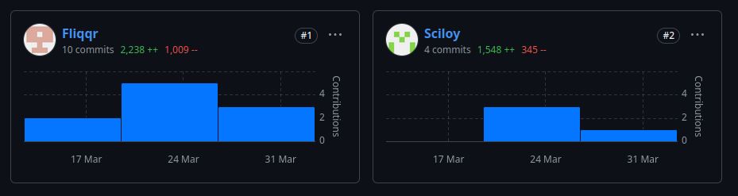
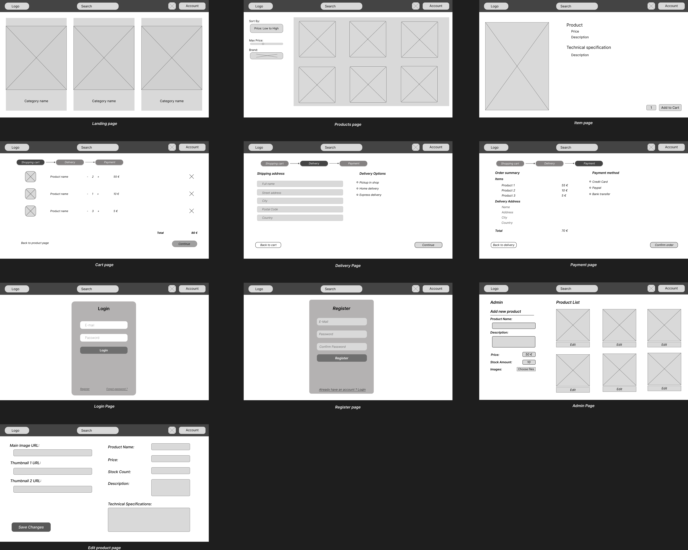
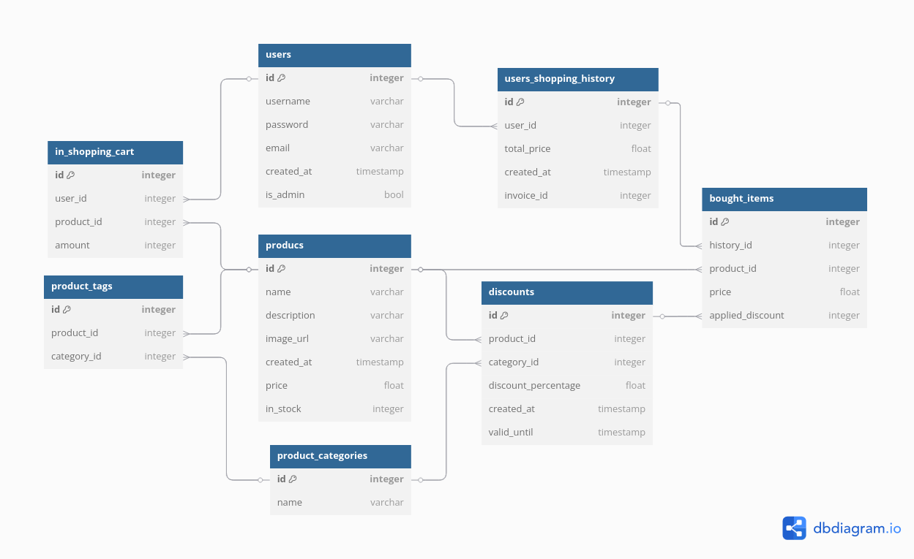

**Laravel Server - How to Start**
Docs: https://laravel.com/docs/12.x

1. Install PHP, Composer & Laravel:
   `/bin/bash -c "$(curl -fsSL https://php.new/install/linux/8.4)"`

2. Build the app (might not be required)
   `npm install && npm run build`
   `composer install`
   `composer global require laravel/installer`
   `php artisan key:generate`

3. Ensure Postgres is running on 127.0.0.1:5432 and ensure database _fiit_wtech_ is created, then run migrations:
   `php artisan migrate`
   OR
   `make db` to reset and seed the database

4. Start the server:
   `composer run dev`

**Or just use `make dev` to reset the DB and start the dev server.**

Notes:
HTML templates are in `/resources/views` (renamed to .blade.php), CSS is in `/resources/css`, images are in `/public/images`, DB config is in `.env`
Dir structure: https://laravel.com/docs/12.x/structure

See index.blade.php as an example of how to include CSS

**Commits:**

Fliqqr - Filip Ďuriš

Sciloy - Matej Csaszar

**Figma - Matej Csaszar**

**DB návrh - Filip Ďuriš**

Useful links:
https://www.figma.com/design/pRDpGc0v6ay6MTd5YS4QYG/Untitled?node-id=1-109&p=f&t=OVBUYLyLXvmLWZQ5-0

https://github.com/kurice/wtech25
